# 🍽️ GastroSaaS API - Multi-Tenant Restaurant Management Platform

## 📌 Visión General
**Rosa Negra SaaS Platform**  GastroSaaS es una plataforma backend B2B diseñada para digitalizar la operación de restaurantes mediante una arquitectura multi-tenant segura y escalable.
La plataforma conecta el flujo físico del restaurante (mesas, mozos, cocina) con una capa digital basada en QR, pedidos en mesa y sistemas KDS.

El sistema conecta el flujo físico del restaurante (mesas, mozos, cocina)
con una capa digital basada en QR, pedidos en mesa y KDS.
---

## 🏗️ Arquitectura y Soluciones Técnicas

* **Aislamiento Multi-Tenant:** Implementación de seguridad a nivel de base de datos donde cada petición inyecta un `@CurrentTenantId`, asegurando que un restaurante jamás pueda acceder a los datos de otro.
* **Control de Concurrencia (Optimistic Locking):** Uso de `@Version` para manejar entornos concurrentes. Previene colisiones de datos cuando múltiples mozos intentan modificar o cobrar la misma mesa simultáneamente (HTTP 409 Conflict).
* **Manejo Centralizado de Excepciones:** Un `GlobalExceptionHandler` robusto que estandariza las respuestas JSON para validaciones (`@Valid`), errores de negocio y bloqueos de seguridad (`AccessDeniedException`).
* **Feature Toggles (Módulos Dinámicos):** La plataforma permite encender o apagar funcionalidades (reservas, auto-pedido, mozos) dependiendo de la suscripción (Plan) que pague cada inquilino.

---

## 📦 Organización del Proyecto (Feature-Based)

### 📦 Estructura de paquetes (Feature-Based Architecture)

El backend sigue una organización **feature-based**, donde cada dominio de negocio se encapsula dentro de su propio módulo.

Esto permite:
- Mayor mantenibilidad
- Escalabilidad del código
- Bajo acoplamiento entre componentes

#### Vista general de la estructura

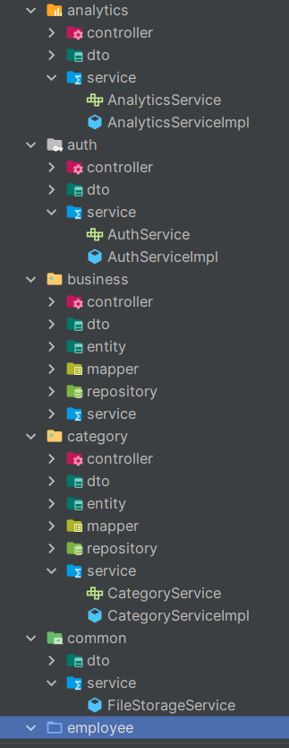

#### Módulos del sistema

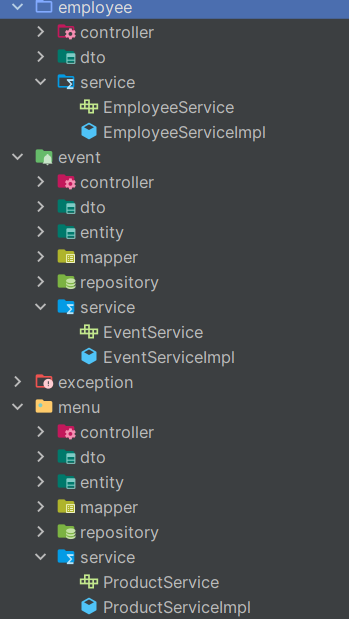
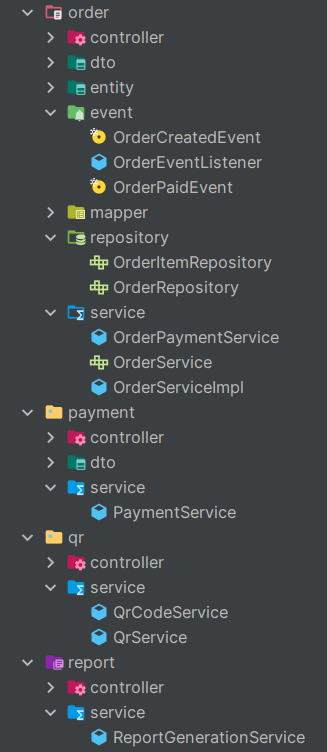

#### Módulos operativos

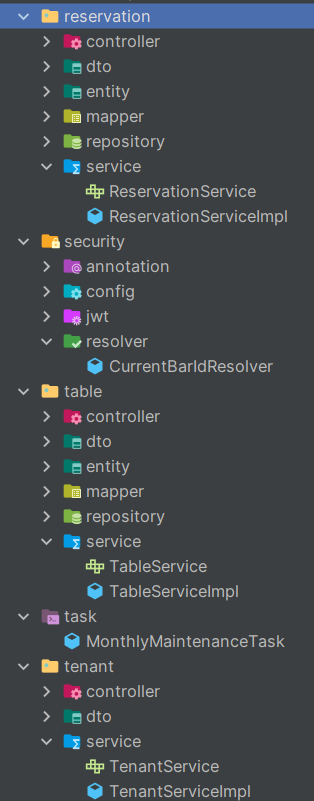
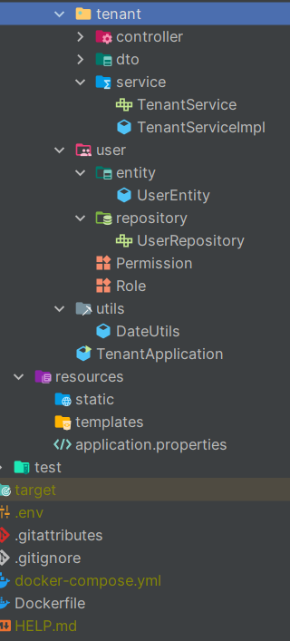

---

## 🧩 Ecosistema de Módulos

### 🟢 Módulo Core (Base)
Funcionalidades por defecto al aprovisionar un nuevo restaurante:
* **Menú Digital Web:** Catálogo público de productos y categorías optimizado.
* **Branding & Setup:** Personalización de logo, horarios dinámicos e integración con Google Maps.
* **QR General:** Generación automática de códigos QR institucionales en formato PNG mediante **Google ZXing**.

### 💎 Módulos Premium (Upselling)
* 📲 **Módulo Staff (Mozos):** Permite al personal autenticado gestionar comandas, enviar órdenes al KDS y cerrar mesas.
* 🛒 **Módulo Self-Service:** Flujo físico-digital parametrizado. El cliente escanea el QR de su mesa (ej: `app.midominio.com/bar-id?table=5`), arma su pedido y paga desde el celular (Integración nativa con MercadoPago).
* 👨‍🍳 **Módulo KDS (Kitchen Display System):** Cola de trabajo en tiempo real para cocineros, filtrada estrictamente por estados activos (`PENDIENTE`, `PREPARANDO`).
* 📅 **Módulo de Reservas:** Motor de asignación de mesas con validación de cupos y estados.
* 📊 **Módulo Analytics & Contabilidad:** Generación de reportes financieros en formato CSV (procesados en memoria) y tareas programadas (`@Scheduled`) para la consolidación nocturna de datos.

---

## 👥 Seguridad y Control de Accesos (RBAC)

La seguridad está protegida por **Spring Security** y **JWT Stateless**, implementando un modelo jerárquico de permisos granulares (`@PreAuthorize`).

| Rol | Alcance | Descripción de Permisos |
|---|---|---|
| **SUPER_ADMIN** | Global | Control total del SaaS. Aprovisiona inquilinos, gestiona planes y enciende módulos premium (Feature Toggles). |
| **ADMIN** | Tenant Local | Dueño del restaurante. Aislamiento estricto de datos. Gestiona menú, empleados, mesas y exporta reportes financieros. |
| **SUPERVISOR** | Tenant Local | Encargado de turno. Controla operaciones de salón, anula comandas y supervisa al personal operativo. |
| **MOZO** | Tenant Local | Staff de salón. Exclusivo para apertura de mesas, adición de ítems a comandas y facturación. |
| **COOK** | Tenant Local | Personal de cocina. Acceso exclusivo a la interfaz KDS para cambiar estados de preparación. |

---

## 🛠️ Stack Tecnológico

**Core & Web**
* Java 21
* Spring Boot 4.x
* Spring Web MVC
* Spring Mail (Notificaciones automáticas)

**Persistencia & Datos**
* PostgreSQL (Compatible con Neon DB / Supabase)
* Spring Data JPA / Hibernate
* Jakarta Bean Validation

**Seguridad**
* Spring Security 6
* JSON Web Tokens (JWT)
* Filtros personalizados para Multi-Tenancy

**Herramientas & Librerías**
* **Google ZXing:** Generación local de códigos QR en formato PNG evitando dependencias de APIs externas.
* **Docker & Docker Compose:** Containerización para despliegue y entornos de desarrollo locales.
* **OpenAPI / Swagger:** Documentación interactiva de la API REST.

---

## Estrategia Comercial (SaaS Plans)

La arquitectura de la plataforma está diseñada para soportar un modelo de negocio SaaS escalable mediante distintos niveles de servicio:

### Starter
- Menú Digital QR
- Integración con WhatsApp  
- Orientado a captación de clientes (Lead Magnet)

### Pro
Incluye todo lo del plan **Starter**, más:
- Módulo de gestión para mozos (KDS)
- Motor de eventos

### Enterprise
Incluye todo lo del plan **Pro**, más:
- Self-Service (pedidos desde QR en la mesa)
- Integración con pasarela de pagos
- Analytics avanzados

---

## 📸 Assets / Capturas del Sistema

Material visual del proyecto (diagramas, capturas y recursos gráficos).

# Screenshots

## Authentication

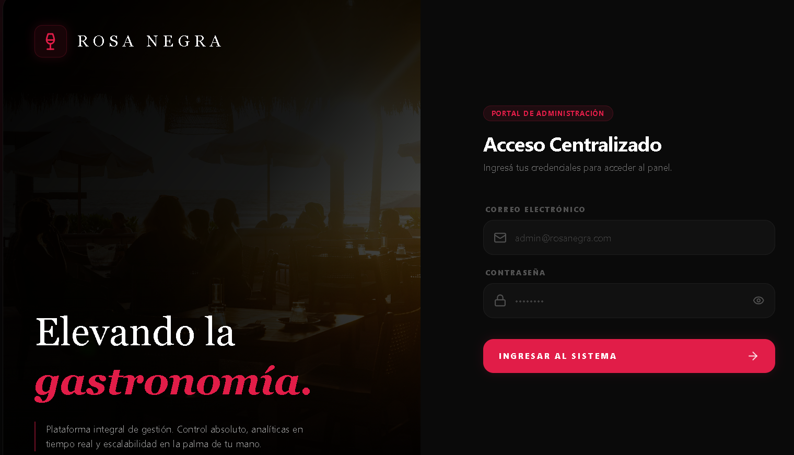

---

## Dashboard

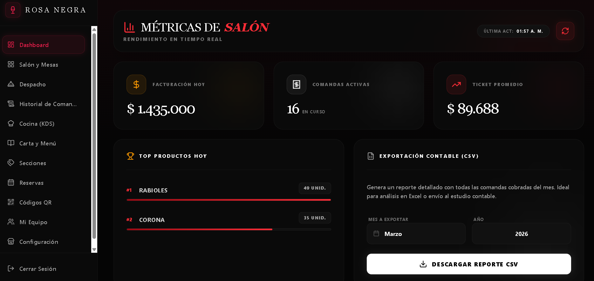

---

## Business Configuration

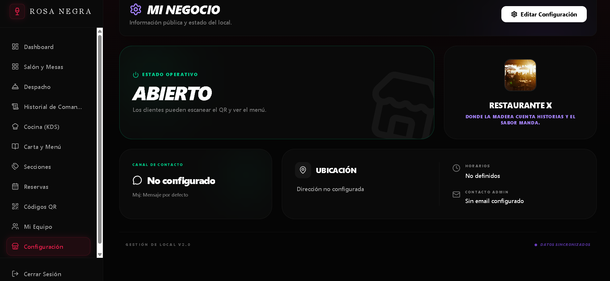

Configuración central del tenant: información del negocio, estado operativo, contacto y datos públicos utilizados por el sistema.

---

## Products Management

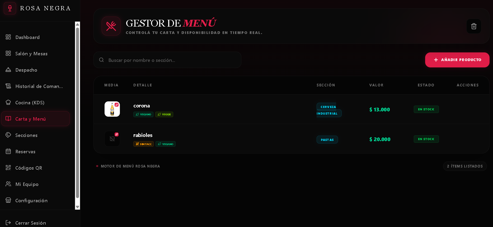

Gestión completa de productos del menú: creación, edición, activación/desactivación y organización por categorías.

### Product Modal

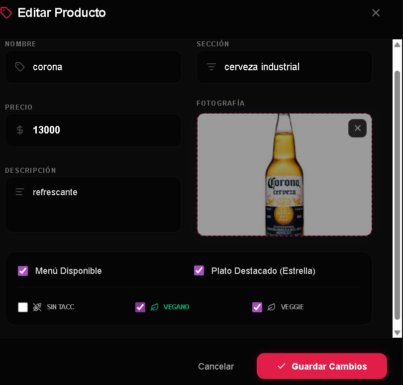

El modal de creación/edición de productos integra subida de imágenes mediante **Cloudinary API**, permitiendo almacenamiento y optimización automática de imágenes en la nube.

---

## Categories

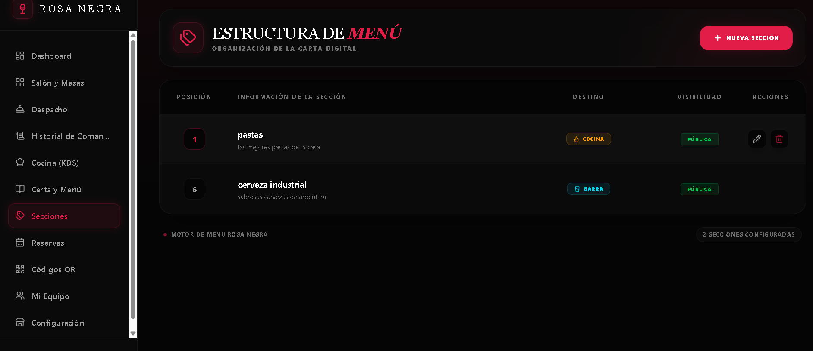

Administración de categorías del menú para organizar productos dentro del sistema.

---

## Orders System

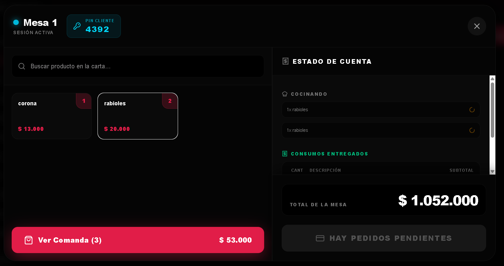

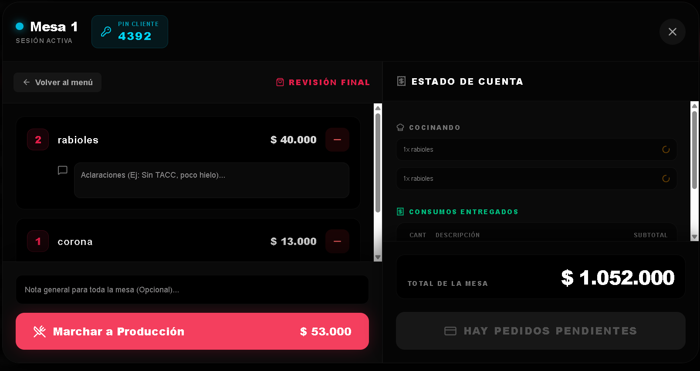

Sistema de gestión de pedidos en tiempo real para cocina y mozos.

---

## Tables by Zone

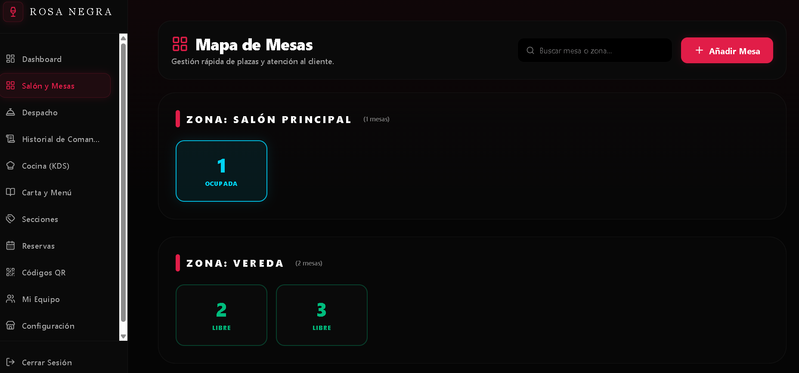

Gestión de mesas organizadas por zonas dentro del establecimiento.

---

## Reservations

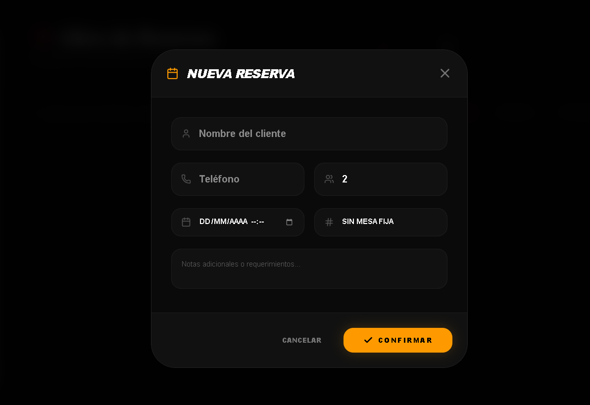

Sistema de reservas para clientes con control de disponibilidad.

---

## QR Generator

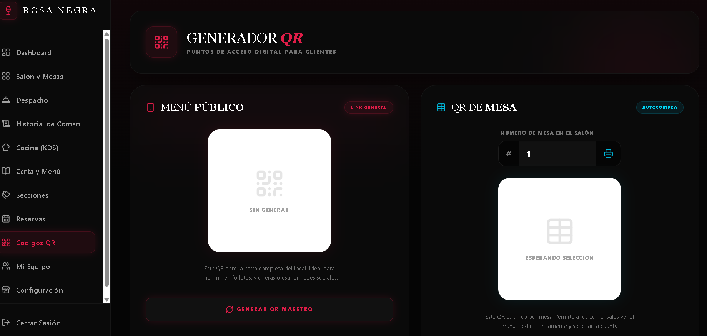

Generador de códigos QR para acceso rápido al menú digital del establecimiento.

---

## Reports

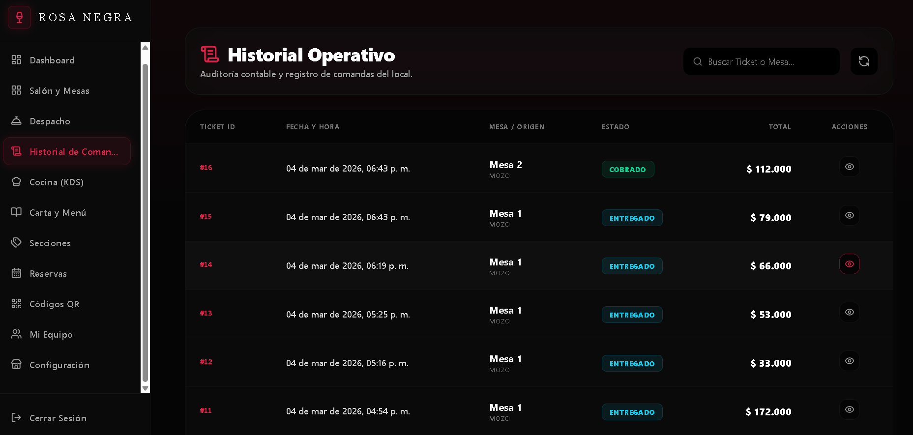

Motor de reportes para exportación de datos contables y operativos en formato CSV.

---

## Access Control

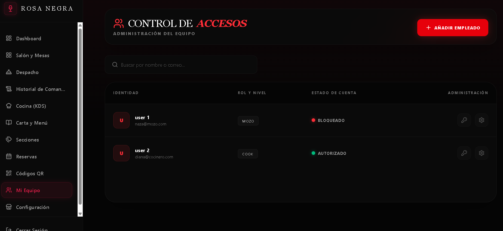

Sistema de control de acceso basado en roles (RBAC) para restringir funcionalidades según el tipo de usuario.

---

## Backend Architecture

### Package Structure

Estructura modular del backend basada en **features**, facilitando mantenibilidad, escalabilidad y separación de responsabilidades.

---

## ⚠️ Nota sobre el repositorio

Este proyecto forma parte de una plataforma SaaS actualmente en desarrollo para uso comercial.

Por motivos de seguridad y despliegue en producción, algunos aspectos como configuración de infraestructura, variables de entorno y ciertos módulos internos no se encuentran incluidos en este repositorio público.
